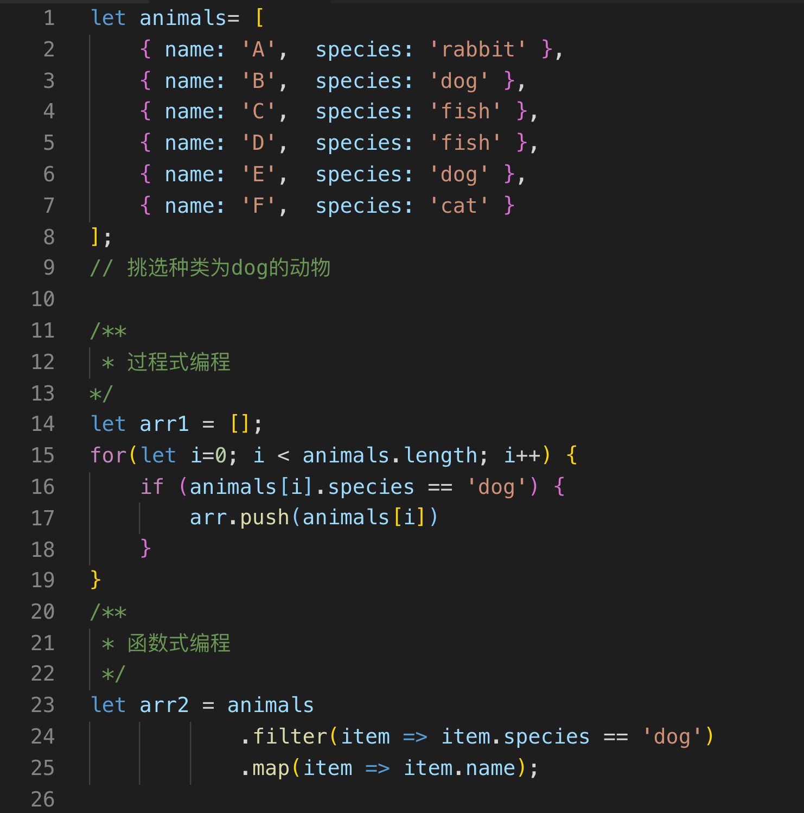
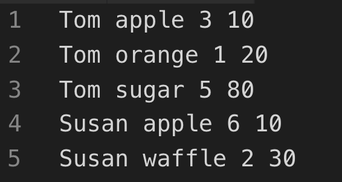
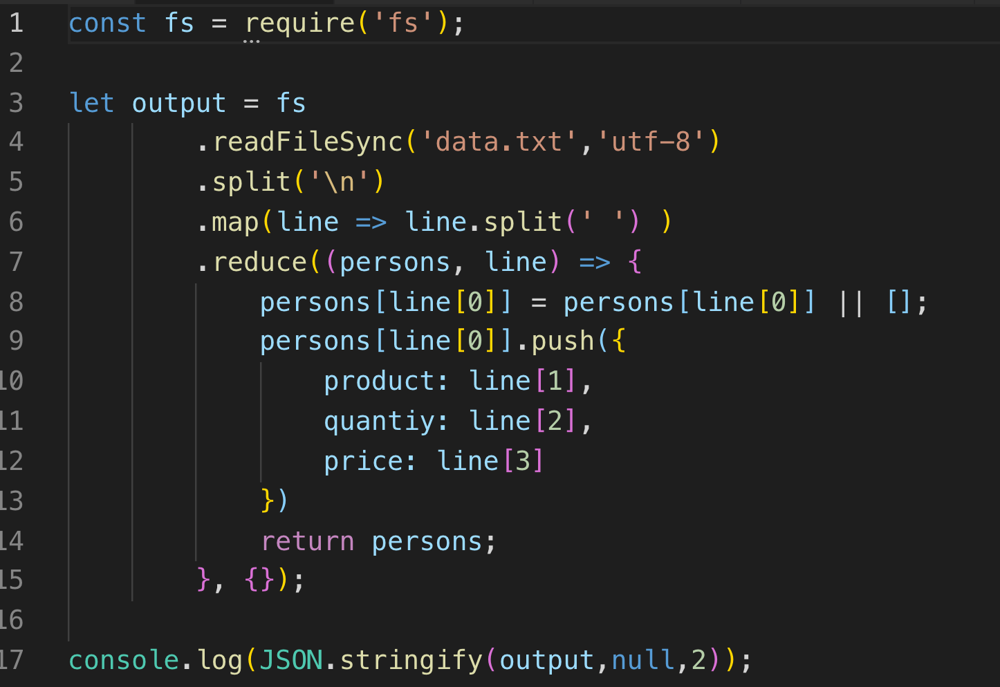
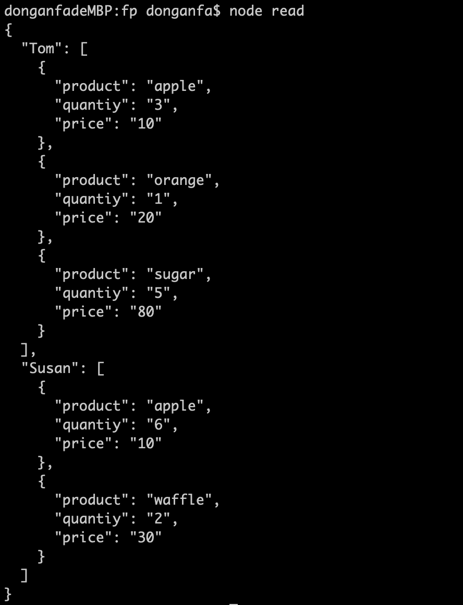
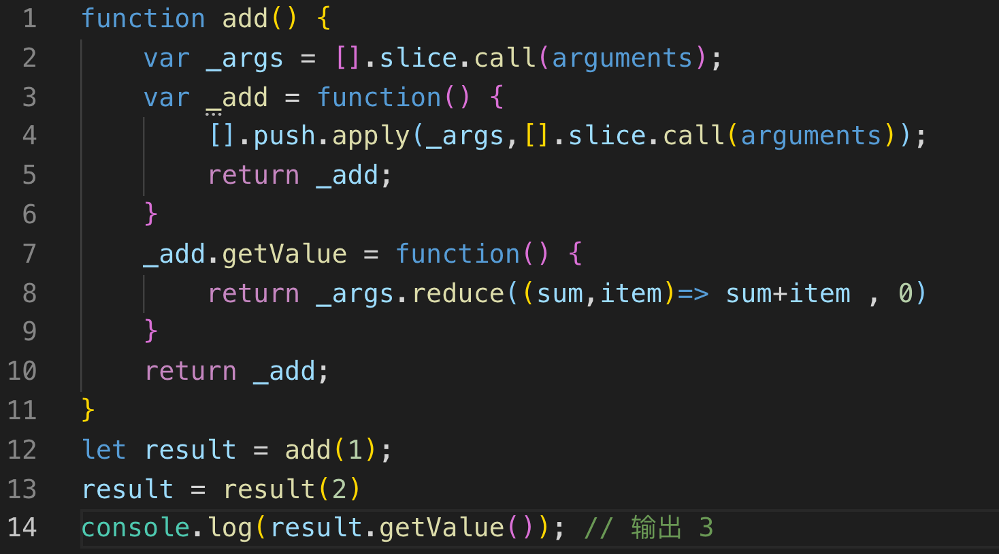

## 编程范式
在说函数式编程前，先回顾一个概念：编程范式。

以下摘自wiki

> 编程范型、编程范式或程序设计法（英语：Programming paradigm），（范即模范、典范之意，范式即模式、方法），是一类典型的编程风格，是指从事软件工程的一类典型的风格（可以对照方法学）。编程范型提供了（同时决定了）程序员对程序执行的看法。例如，在面向对象编程中，程序员认为程序是一系列相互作用的对象，而在函数式编程中一个程序会被看作是一个无状态的函数计算的序列。正如软件工程中不同的群体会提倡不同的“方法学”一样，不同的编程语言也会提倡不同的“编程范型”。

分享在知乎上关于‘编程范式’的两句话：


> 借用哲学的术语，如果说每个编程者都在创造虚拟世界，那么编程范式就是他们置身其中自觉不自觉采用的世界观和方法论。

> 我们常见的架构、设计模式等都是在面向对象这个范式下面进行的设计，而编程范式则是更高一层的概念，它关注的不是怎么用写程序来解决问题，而是关注各种不同的设计程序的思考方式。


**说到底，编程范式是编程时的指导思想，具体到编程语言中，则代表了这个语言的设计方向，即语言是为了便于遵循某种，或者某些思想编程而设计的。多范式编程语言中的多范式，是指这个语言支持使用者采用多种不同的编程范式来撰写编程。C语言是过程式编程语言；Java、C#是面向对象式编程语言；Haskell是函数式编程语言；而C++则是多范式的编程语言。**


编程范式可以分为三大类：过程化编程、面向对象编程以及函数式编程。

#### 过程化编程

* 本质是*冯.诺伊曼机*运行机制的抽象，它的编程思维方式源于计算机指令的顺序排列

* 适合解决线性("按部就班")的算法问题，强调"自上而下"的设计方式


* 程序流程图是过程化语言进行编程的有效辅助途径

	


#### 面向对象编程

* 封装性、继承性、多态性


* 计算机程序的执行是一系列消息在各个对象之间传递


#### 函数式编程


* 以函数作为主要载体的编程方式，用函数去拆解、抽象一般的表达式

* 函数式编程语言：Lisp, Haskell, Clojure ...
	* 特点：不可变数据；无副作用；尾调用优化 ；
* 优点： Less bugs Less time	 	 


这里说一下**尾调用优化**

尾调用：函数 F 调用另一个函数作为它的结束动作。函数调用会在内存中形成一个调用记录，所有的调用记录就形成一个调用栈。如果函数尾调用的是自身，称为尾递归。如果递归没写好，非常消耗内存，很容易发生栈溢出。

```
// 	是尾调用
function f () {
	return g ();
}
// 不是尾调用
function f () {
	let y = g();
	return y;
}
// 不是尾调用
function f () {
	return g() + 1;
}
```


尾调用优化：函数F执行完时，将“球”传给被它调用的任意函数之后，它自己就“消失”了。这就是关键点，因为它打开了尾调用优化的“可能之门”：我们可以简单地重用函数 F 的调用记录，而不是为函数调用创建一个新的调用记录，因此节省了栈空间并且避免了新建一个调用记录所需要的工作量。

个人理解： 尾调用优化是依赖于使用语言自身如何设计的，不是依赖于你是怎么书写这个函数...换言之，你写的函数符合尾调用，但是你使用的语言在编译运行时不进行尾调用优化，最终结果就是你白写了！另一方面，尾调用优化应该不是函数式编程语言特有的特性，两者之间的关系是纯粹的函数式编程语言是支持尾调用优化的。在JavaScript中,可以自行查看下在[ES6在各大平台的兼容性](http://kangax.github.io/compat-table/es6/)


## 函数式编程

引用一句名言：

> 面向对象编程通过封装不确定因素来使代码能被人理解；函数式编程通过尽量减少不确定因素来使代码能被人理解。

函数在函数式编程中的基础元素，与传统编程中（代指过程式编程和面向对象编程）的”函数“有着本质区别：

* 过程式编程和面向对象编程中的函数，实际上是对一系列操作的封装。
* 函数式编程中的函数，是指数学中的函数，即自变量的映射。函数只是两种数值之间的关系：输入和输出。 
	
下图展示了一个合法的x到y的函数关系


相反，下图表示的不是一个函数关系


函数式编程中的变量也不是常规编程语言中的”变量“，即存储状态的单元，而是代数中的变量。即一个值的名称。变量的值是不可变的（immutable），也就是说不允许像命令式编程语言中那样多次给一个变量赋值。比如说在命令式编程语言我们写“x = x + 1”，这依赖可变状态的事实，拿给程序员看说是对的，但拿给数学家看，却被认为这个等式为假。

**纯函数**是函数式编程的中一个特别重要的概念：

* 相同的输入，永远会得到相同的输出，而且没有任何可观察的副作用。

* 纯函数就是数学上的函数，而且是函数式编程的全部。


**副作用**可能包含，但不限于：


* 更改文件系统
* 往数据库插入记录
* 发送一个 http 请求
* DOM 查询
* 访问系统状态
* ..........


**函数式编程的哲学就是假定副作用是造成不正当行为的主要原因**


```
// 纯的
function fn(num) {
	return num+1;
}

// 不纯的
Math.random()


// 不纯的
var x= 1;
function fn(y) {
	return x+y;
}

var arr=[1,2,3,4,5];

// 纯的
arr.slice(0,3) //=> [1,2,3]

// 不纯的
arr.splice(0,3) //=>[1,2,3]
```

函数式编程延伸出来的应用模型很多，这里只举两个例子

* 高阶函数
	* 接受或者返回一个函数的函数称为高阶函数


* 柯里化 Currying
	* 只传递给函数一部分参数来调用它，让它返回一个函数去处理剩下的参数。

	


## FP in JavaScript

虽然JavaScript是面向对象的语言，但是它的一些特性可以使函数式编程范式的思想在JavaScript中体现的得心应手。

### 高阶函数
* 筛选




* 读取data.txt文件
 
data.txt





输出结果


### 柯里化
* 加法



## 参考资料
* [尾调用、优化和 ES6](https://zhuanlan.zhihu.com/p/38079233)
* [JS 函数式编程指南](https://legacy.gitbook.com/book/llh911001/mostly-adequate-guide-chinese/details)
* [我眼中的 JavaScript 函数式编程](http://taobaofed.org/blog/2017/03/16/javascript-functional-programing/)
* [傻瓜函数式编程](https://github.com/justinyhuang/Functional-Programming-For-The-Rest-of-Us-Cn/blob/master/FunctionalProgrammingForTheRestOfUs.cn.md)