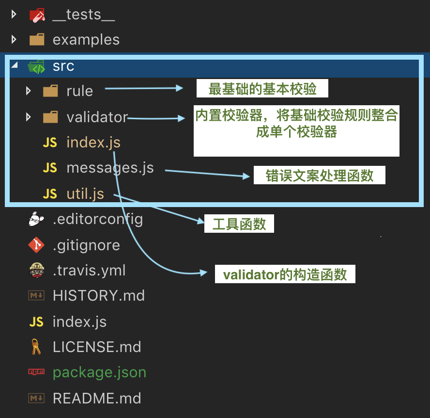

## async-validtor介绍和使用
#### 简介
[async-validtor](https://github.com/yiminghe/async-validator)是一个用于校验的库，iview中表单验证是基于它实现的，叫做“异步校验”的原因是校验只有当需要是才校验，并不是创建校验时就立刻进行校验....


## 源码浅析（版本号：1.10.0）
#### 源码结构
src文件下是async-validator的源代码



#### 创建过程
validtor的创建过程

```
var schema = require('async-validator');
var descriptor = {
    name: {
        type: 'string',
        required: true
    }
}
var validate = new schema(descriptor);
```
源码


define函数源码,绿色备注是我写的


创建流程如下：


#### 验证过程

大致流程：

1. 将用户输入的descriptor转为可验证的series
2. 遍历series,调用每个key的每个rule的validator，生成错误文案
3. 执行回调函数

流程如下：


注意：

1. 自己写或者内置的validator格式都是 `function(rule, value, callback, source, options){} `
2. asyncSerialArray（有序校验）处理series数组，当某一规则校验失败时，即终止校验，
3. asyncParallelArray处理series数组，所有规则都被交完，终止校验

## 收获
第一次正式看源代码，采用的学习方式：

1. 先参考别人已经分享的资料，可以在看源代码之前增加建立一个模糊体系
2. 最后，自己实践。
	* 找到程序入口，一步步走，打log,写代码注释，当思路走不下去时，可以回头重新捋顺

以后写代码可以借鉴的地方：

```
// 浅拷贝
rule = { ...rule };

```

## 参考资料

- [浅析async-validator源码](https://zhuanlan.zhihu.com/p/32306570)
- [源码](https://github.com/yiminghe/async-validator)
