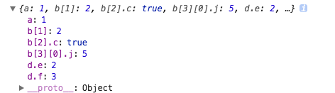

### 扁平化
数组的扁平化是指将一个嵌套多层的数组数组转换为只有一层的数组。对象的扁平化是指将属性的value展开，挂载到对象上... 举例说明

假设输入为

```
const input={
	a: 1,
	b: [ 1, 2, { c: true }, [ 3 ] ],
	d: { e: 2, f: 3 },
	g: null, 
}		
```

输出为


```
{
    "a": 1,
    "b[0]": 1,
    "b[1]": 2,
    "b[2].c": true,
    "b[3][0]": 3,
    "d.e": 2,
    "d.f": 3,
    // "g": null,  值为null或者undefined，丢弃
}
```


本题实质是<span style="color:red;font-weight:bold;font-size:26px;">递归</span>

代码如下：

```

function flatten(target,prefix) {
    var result={};
    prefix= prefix === undefined ? '' : prefix;
    if( target && typeof target == 'object' ){
        Object.keys(target).forEach(key=>{
            let _prefix= Array.isArray(target) ?
                            `${prefix}[${key}]`
                            :  `${ prefix ? prefix+'.' : prefix}${key}`;
            let _result=flatten(target[key],_prefix);
            if(_result && typeof _result =='object'){
                Object.assign(result,_result);
            }else if(_result !== null && _result !== undefined){
                result[_prefix]=_result;
            }

        });
    }else {
        return target;
    }
    return result;
}
```


测试结果：


输入为：

```
{
	a: 1,
	b: [ undefined, 2, { c: true }, [ {i:null,j:5} ] ],
	d: { e: 2, f: 3 },
	g: null,
}
```

结果为：



输入为：
```
[ undefined, 2, { c: true }, [ {i:null,j:5} ] ]
```
结果为：


