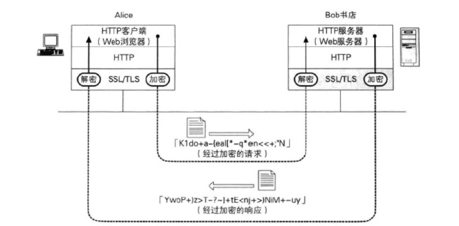
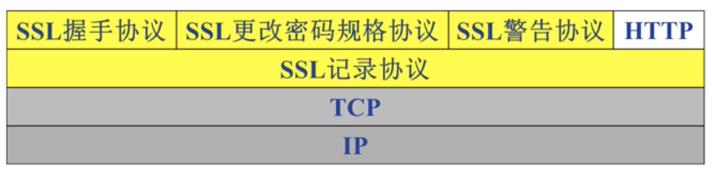
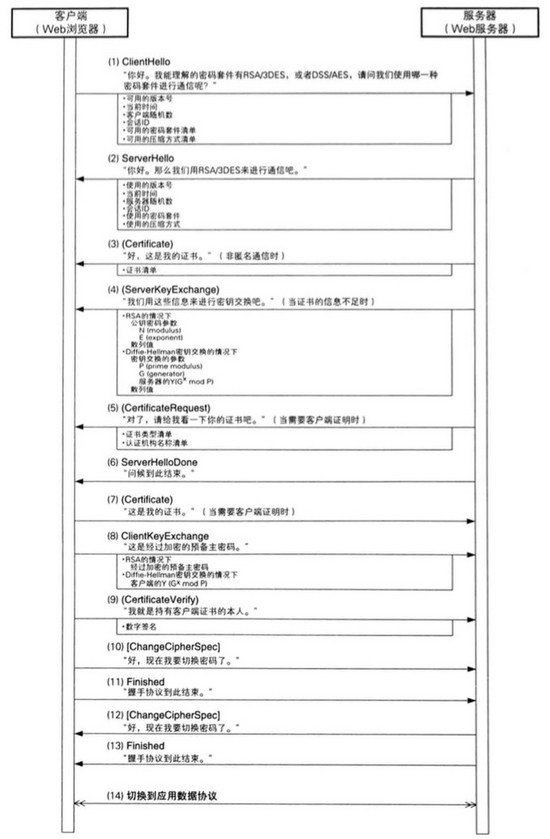
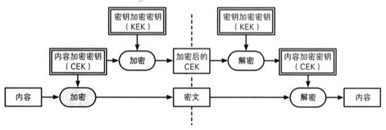

# HTTPS了解下

### 什么使用HTTPS 
HTTP属于明文传输，存在以下风险：
- 窃听风险（eavesdropping）：第三方可以获知通信内容。
- 篡改风险（tampering）：第三方可以修改通信内容。
- 冒充风险（pretending）：第三方可以冒充他人身份参与通信

HTTPS是在TCP和HTTP之间添加了一层SSL/TLS，用于加密传送的内容。

SSL/TLS协议可以解决：
- 所有信息都是加密传播，第三方无法窃听。
- 具有校验机制，一旦被篡改，通信双方会立刻发现。
- 配备身份证书，防止身份被冒充。

相对于HTTP请求，HTTPS请求过程简单如下：
1. 建立TCP连接
2. **建立SSL连接，生成用于加密本次信息传输的会话密钥**
3. 使用会话密钥加密内容，发送给服务端
4. 服务端接受解密内容，加密响应内容，发送给客户端
5. 客户端接受加密内容，进行解密。
6. TCP连接关闭

其中步骤2是HTTPS和HTTP最大的区别：通过SSL生成一个会话密钥

### SSL 
SSL不是一个单独的协议，而是两层协议！

SSL握手目的是为了SSL/TLS 握手其实就是为了 安全地协商出一份对称加密的密钥。

1. ClientHello(客户端->服务器)
    - 客户端向服务器发送ClientHello消息，消息内容主要包括：可用的版本号、当前时间、客户端随机数、会话ID、可用的密码套件清单、可用的压缩方式清单  
2. ServerHello(服务器->客户端)
    - 对于客户端发送的ClientHello消息，服务器会返回一个ServerHello消息，消息内容主要包括：使用的版本号、当前时间、服务器随机数、会话ID、使用的密码套件、使用的压缩方式。这一步确定了通信中使用的“版本号”、“密码套件”和“压缩方式”。 
3. Certificate(服务器->客户端)
    - 服务器再向客户端发送Certificate消息，主要是 证书清单 。首先发送的是服务器的证书，然后会按顺序发送对服务器证书签名的认证机构的证书。      
4. ServerKeyExchange(服务器->客户端)
    - 当Certificate消息不足以满足需求时，服务器会向客户端发送ServerKeyExchange消息。具体所发送的消息内容会根据所使用的密码套件而有所不同。  
5. CertificateRequest(服务器->客户端)
    - CertificateRequest消息用于服务器向客户端请求证书，这是为了进行 客户端认证 。消息内容还包括：服务器能够理解的证书类型清单和认证机构名称清单。当不使用客户端认证时，不会发送CertificateRequest消息。  
6. ServerHelloDone(服务器->客户端)
    - 服务器发送ServerHelloDone消息则表示从ServerHello消息开始的一系列消息的结束。 
7. Certificate(客户端->服务器)
    - 当服务器发送了CertificateRequest消息时，则客户端会发送Certificate消息，将自己的证书同消息一起发送给服务器。如果服务器没有发送CertificateRequest消息，客户端则不会发送Certificate消息。  
8. ClientKeyExchange(客户端->服务器)
    - 客户端发送ClientKeyExchange消息。当密码套件中保护RSA时，会随消息一起发送 经过加密的预备主密码 。当密码套件中包含Diffie-Hellman密钥交换时，会随消息一起发送 Diffie-Hellman的公开值 。预备主密码是由客户端生成的随机数，之后会被用作生成主密码的种子。根据预备主密码，服务器和客户端会计算出相同的 主密码 ，然后再根据主密码生成：对称密码的密钥、消息认证码的密钥、对称密码的CBC模式中使用的初始化向量(IV)。  
9. CertificateVerify(客户端->服务器)
    - 客户端只有在服务器发送CertificateRequest消息时才会发送CertificateVerify消息。这个消息的目的是向服务 器证明自己的确持有客户端证书的私钥。为了实现这一目的，客户端会计算“主密码”和“握手协议中传送的消息”的散列值，并加上自己的数字签名后发送给服务 器。  
10. ChangeCipherSpec(客户端->服务器)、
    - 客户端发送ChangeCipherSpec消息表示要切换密码。实际上，这不是握手协议的消息，而是密码规格变更协议的消息。在 ChangeCipherSpec消息之前，客户端和服务器之间以及交换了所有关于密码套件的信息，因此在收到这一消息时，客户端和服务器会同时切换密 码。在这一消息之后，TLS记录协议就开始使用双方协商决定的密码通信方式了。 
11. Finished(客户端->服务器)
    - 客户端发送Finished消息表示握手协议到此结束。这个消息其实是使用切换后的密码套件来发送的。实际负责加密操作的是TLS记录协议。 
12. ChangeCipherSpec(服务器->客户端)
    - 这次轮到服务器发送ChangeCipherSpec消息了，表明服务器要切换密码了。
13. Finished(服务器->客户端)
    - 服务器也同样发送Finished消息表明握手协议到此结束。这个消息同样使用切换后的密码套件来发送。实际负责加密操作的也是TLS记录协议。
14. 切换至应用数据协议 

以上配图和文字是搬运的[这篇文章](https://blog.csdn.net/zy1049677338/article/details/62424708)。

用我的大白话说，过程可以简化如下：

1. 客户端向服务端发起SSL链接请求message,重要内容有：
    - 客户端支持的密钥组（对称加密算法集合）
    - 一个随机数 client_random  
2. 服务端接受请求后，向客户端发送一个message,重要内容有：
    - 数字证书
    - 一个随机数 server_random
    - 公钥（非对称加密）
    - 数字签名
3. 客户端接受服务端message后，重点完成以下：
    - 根据数字证书，验证服务端身份
    - 生成第三个随机数，使用公钥加密得到pre_master key，发送给服务端
    - 根据两个随机数和pre_master key 通过密钥派生函数派生这次SSL连接的会话密钥，这个会话密钥是对称密钥，用于加密传输的信息
    - 发送finished消息，告诉服务端握手结束
4. 服务端接受客户端message后，重点完成以下：
    - 根据两个随机数和pre_master key 通过密钥派生函数派生这次SSL连接的会话密钥，这个会话密钥是对称密钥，用于加密传输的信息
    - 发送finished消息，告诉客户端握手结束 

SSL使用了对称加密(会话密钥)来加密内容，用非对称加密（公钥私钥）和三个随机数来保证会话密钥是安全的，使用信息摘要和数字证书来验证服务端身份的安全性，实际握手结束后还会使用MAC算法保证信息的完整性

以上配图来自[这篇文章](https://blog.csdn.net/zy1049677338/article/details/62424708)

以上的SSL握手过程，是在客户端第一次SSL请求，并且服务端不需要验证客户端身份的过程。当在第一次握手时发生错误，需要重新SSL链接时候，之间的通话会根据俄SESSION_ID来优化，具体参看[这篇文章](https://zhuanlan.zhihu.com/p/22142170)

留两个问题：

- [HTTPS 要比 HTTP 多用多少服务器资源？](https://www.zhihu.com/question/21518760/answer/19698894)
-  [HTTPS必须在每次请求中都要先在SSL层进行握手传递秘钥吗？](https://www.zhihu.com/question/67740663/answer/256288406)

### 参考资料
- [读《图解密码技术》（三）：密钥、随机数和应用技术](https://blog.csdn.net/zy1049677338/article/details/62424708)
- [深入揭秘HTTPS安全问题&连接建立全过程](https://blog.csdn.net/zy1049677338/article/details/62424708)
- [SSL/TLS通信 ](https://github.com/zhangyachen/zhangyachen.github.io/issues/31)