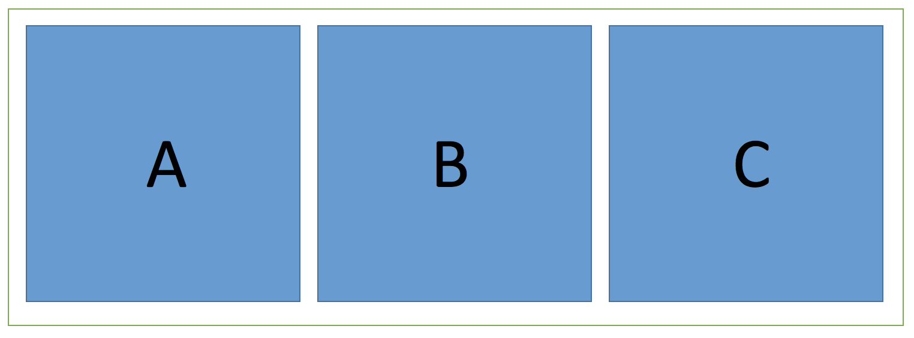

### padding
元素A的padding的值可以为固定数值和百分比，且为非负数。当padding用百分比表示时，百分比是相对于containing block的宽度，即父元素的宽度。


### 小题目




如上图所示，一个容器里面水平排列了三个正方形。正方形的边长会随着容易的宽度变化而变化，即响应式。

#### 思路
* 使用flex保证正方形在横向的缩放
* 使用padding-top或者padding-bottom保证正方形在纵向的缩放


HTML代码：

```
	<div id="box">
        <div class="item" style="background: blueviolet"></div>
        <div class="item" style="background: greenyellow"></div>
        <div class="item" style="background: blanchedalmond"></div>
    </div>
```


CSS代码：

```
	#box{
   		padding:2px;
      	background: red;
      	display: flex;
      	justify-content:center;
   	}
        
   .item{
       flex: 0 0 33%;
       padding-top:33%;
   }
```

备注：

* `justify-content`属性定义了项目在主轴上的对齐方式
* `flex` 属性是flex-grow, flex-shrink 和 flex-basis的简写

代码参考[square1.html](../source/square1.html)


## 进阶

新问题：

1. 正方形数量改变了，不想修改CSS，怎么办？
2. 正方形需要显示具体内容,但是padding-top把它挤下去了，怎么办？

代码参考[square2.html](../source/square2.html)

效果图如下：


