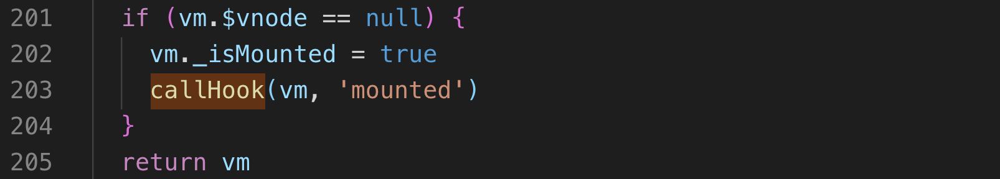
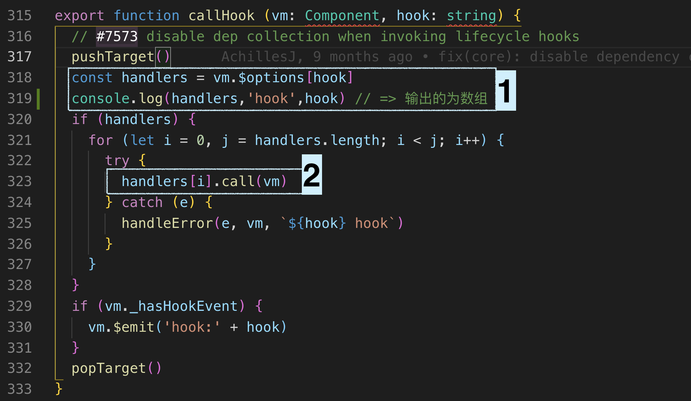

Vue给一个vue实例在生命周期中设置了一些钩子函数，在源码中实际调用方式如上

callHook的开始和结束调用了pushTarger和popTarget，两个函数来自于observer，我猜是响应式的收集和分发依赖有关，先不看

- 方块1
    - vue实例化最开始会进行合并参数，将合并的参数挂载到vm.$options上
    - 通常在实例化vue时，我们传入的钩子往往只是一个函数对象，但是在这里，它转换成了数组，这一步骤是在合并选项时候转换的
    - 为什么要把传入的钩子函数，要转为数组？ 为了mixin，将mixin和自身的合并成数组，遍历执行
- 方块2
    - 真正执行钩子函数
    - 若执行的不是函数，会报错