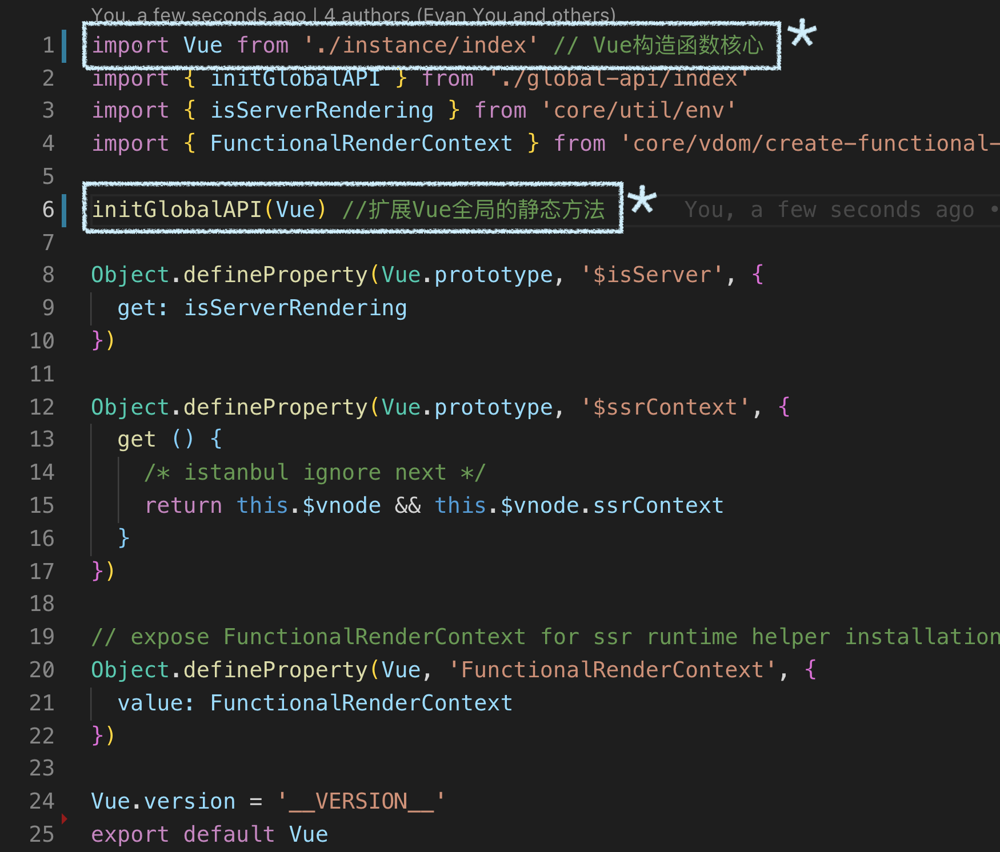
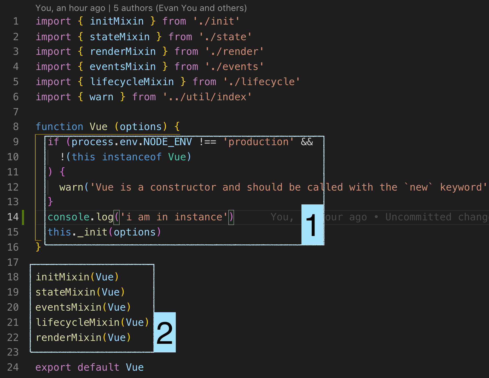
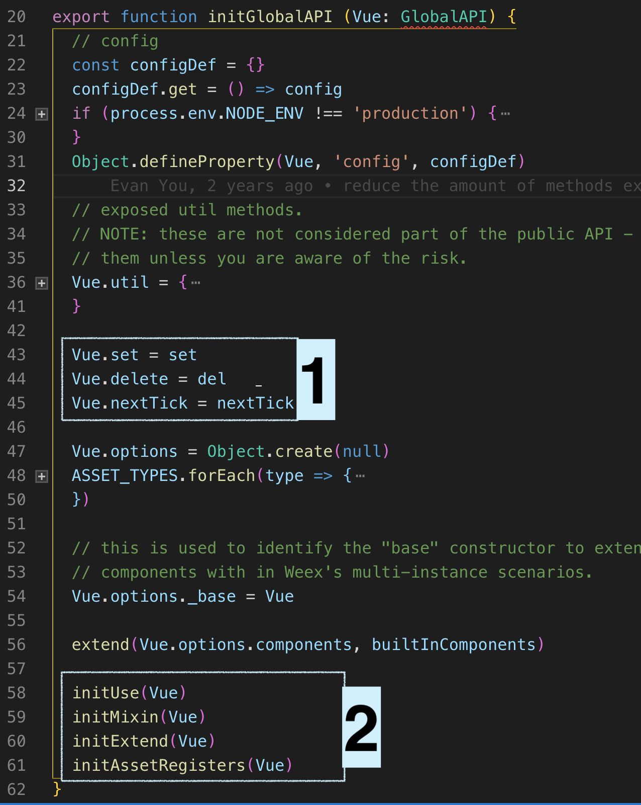

水平有限，理解不对地方欢迎指出！

Vue构造函数的初始化工作：
- 扩展Vue.prototype上的功能
- 扩展Vue上的功能,即全局的静态方法

源码：（src/core/index.js）

扩展Vue.prototype功能

- 方块1
    - new Vue({...}) 真实执行的部分
    - 判断Vue的执行方法：只能通过new,不能Vue()
    - _init方法是Vue.prototype扩展的功能
- 方块2
    - 扩展Vue.prototype功能

扩展Vue功能

函数体较长，但是主要工作比较明确，框选我认为主要的

- 方块1
    - 常用的set,delete,nextTick函数
- 方块2 
    - 函数存在于src/core/global-api目录下
    - ASSET_TYPES：component、directive、filter
